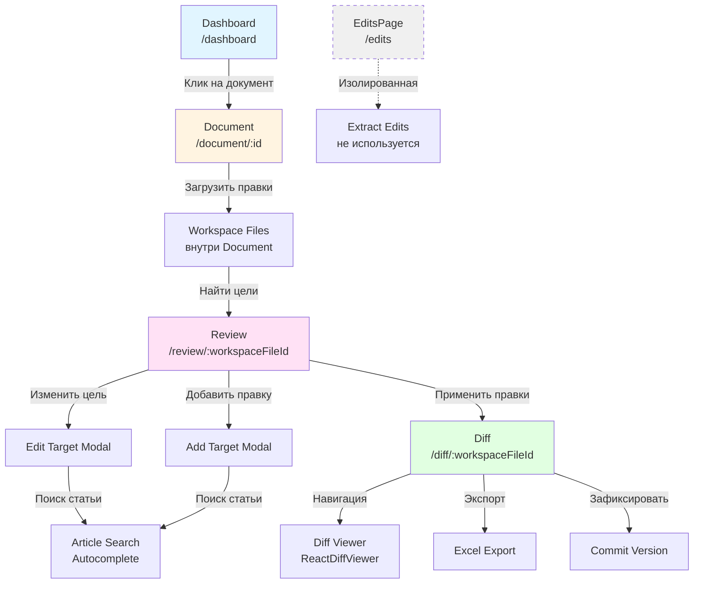
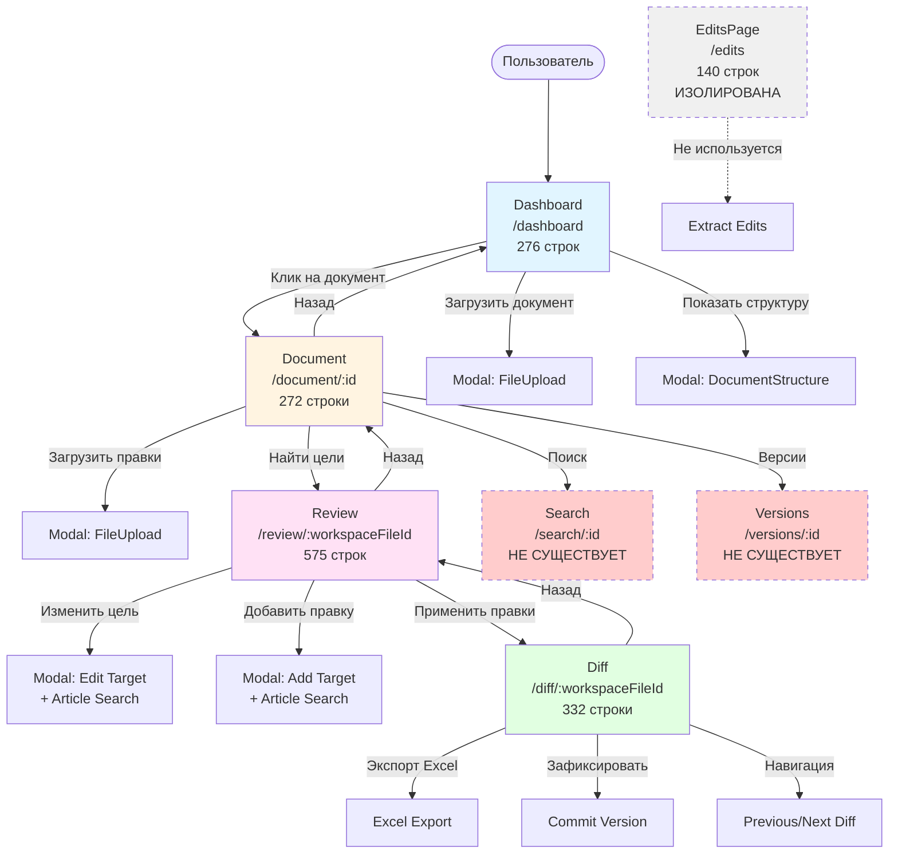

# Карта навигации фронтенда Legal Diff

## 📊 1. Страницы и маршруты

### Таблица страниц

| Страница | Маршрут | Назначение | Параметры |
|----------|---------|------------|-----------|
| **DashboardPage** | `/dashboard` | Главная страница - список документов | - |
| **DocumentPage** | `/document/:id` | Страница конкретного документа | `id` - ID документа |
| **ReviewPage** | `/review/:workspaceFileId` | Проверка и редактирование целей правок | `workspaceFileId` - ID файла правок |
| **DiffPage** | `/diff/:workspaceFileId` | Просмотр изменений (diff) | `workspaceFileId` - ID файла правок |
| **EditsPage** | `/edits` | Альтернативная страница извлечения правок | - |

### Связи между страницами

```
Dashboard → Document → Review → Diff
   ↑          ↑          ↑        ↑
   └──────────┴──────────┴────────┘
         (кнопка "Назад")
```

**Основной flow:**
1. **Dashboard** → клик на документ → **Document** (`/document/{id}`)
2. **Document** → "Найти цели" → **Review** (`/review/{workspaceFileId}`)
3. **Review** → "Применить правки" → **Diff** (`/diff/{workspaceFileId}`)
4. **Diff** → "Назад" → возврат на **Review** или **Document**

**EditsPage** - изолированная страница, не связана с основным flow.

---

## 🌳 2. Многоуровневость интерфейса

### Дерево навигации (4 уровня)

```
Level 1: Dashboard (/dashboard)
  └─ Level 2: Document (/document/:id)
       ├─ Level 2.1: Workspace Files (список файлов правок)
       │    └─ Level 3: Review (/review/:workspaceFileId)
       │         ├─ Level 3.1: Edit Target Modal (редактирование цели)
       │         │    └─ Level 4: Article Search (поиск статьи)
       │         └─ Level 3.2: Add Target Modal (добавление правки)
       │              └─ Level 4: Article Search (поиск статьи)
       └─ Level 2.2: Quick Actions
            ├─ Search (не реализовано - navigate(`/search/${id}`))
            └─ Versions (не реализовано - navigate(`/versions/${id}`))
       └─ Level 3: Diff (/diff/:workspaceFileId)
            └─ Level 3.1: Diff Viewer (ReactDiffViewer)
                 └─ Level 4: Navigation (предыдущее/следующее изменение)
```

### Схема вложенности (Mermaid)



---

## 🧩 3. Основные компоненты

### Повторяющиеся UI-компоненты

| Компонент | Использование | Сложность |
|-----------|---------------|-----------|
| **Button** | Все страницы | Низкая |
| **Card** | Все страницы | Низкая |
| **Modal** | Dashboard, Document, Review | Средняя |
| **FileUpload** | Dashboard, Document, EditsPage | Средняя |
| **LoadingSpinner** | Все страницы | Низкая |
| **Input** | Review (поиск) | Низкая |
| **Toast** | Dashboard, EditsPage | Низкая |
| **DocumentStructure** | Dashboard (модальное окно) | Средняя |
| **EditsReview** | EditsPage | Средняя |
| **DeletingWidget** | Dashboard | Низкая |

### Сложная логика отображения

#### 1. **ReviewPage** (575 строк)
**Условия рендеринга:**
- `isLoading` → показ спиннера с разными сообщениями
- `targets.length === 0` → пустое состояние
- `targets.map()` → список целей с разными статусами
- `editingTarget` → модальное окно редактирования
- `isAddingTarget` → модальное окно добавления
- `hasUnconfirmed` → блокировка кнопки "Применить правки"
- `target.article_exists === false` → красный badge
- `target.article_id` → оранжевый/синий badge

**Состояния:**
- `targets` - список целей
- `isLoading` - загрузка
- `taskStatus` - статус Celery задачи
- `editingTarget` - редактируемая цель
- `searchQuery` - поисковый запрос
- `searchResults` - результаты поиска
- `isSearching` - поиск в процессе
- `isAddingTarget` - добавление новой цели
- `newInstructionText` - текст новой правки
- `newArticleId` - выбранная статья

#### 2. **DiffPage** (332 строки)
**Условия рендеринга:**
- `isLoading` → спиннер
- `diffs.length === 0` → пустое состояние
- `currentDiff` → отображение diff viewer
- `diffs.length > 1` → навигация (предыдущее/следующее)
- `isPolling` → индикатор обновления
- `isDarkTheme` → темная/светлая тема для diff viewer

**Состояния:**
- `diffs` - список изменений
- `currentIndex` - текущий индекс
- `isLoading` - загрузка
- `isCommitting` - сохранение версии
- `isExporting` - экспорт
- `totalTargets` - общее количество целей
- `isPolling` - опрос обновлений
- `pollingIntervalRef` - ссылка на интервал

#### 3. **DocumentPage** (272 строки)
**Условия рендеринга:**
- `isLoading` → спиннер
- `!document` → ошибка "Документ не найден"
- `workspaceFiles.length > 0` → список файлов правок
- `isUploadModalOpen` → модальное окно загрузки

**Состояния:**
- `document` - текущий документ
- `workspaceFiles` - файлы правок
- `isLoading` - загрузка
- `isUploadModalOpen` - модальное окно
- `isUploading` - загрузка файла

#### 4. **DashboardPage** (276 строк)
**Условия рендеринга:**
- `isLoading` → скелетоны (SkeletonCard)
- `documents.length === 0` → пустое состояние
- `documents.map()` → сетка документов
- `deletingId === doc.id` → DeletingWidget
- `selectedDocument` → модальное окно структуры
- `isUploadModalOpen` → модальное окно загрузки

**Состояния:**
- `documents` - список документов
- `isLoading` - загрузка
- `isUploadModalOpen` - модальное окно
- `isUploading` - загрузка
- `selectedDocument` - выбранный документ
- `deletingId` - удаляемый документ

---

## 🔍 4. Проблемные места

### Самые большие компоненты (по количеству строк)

| Компонент | Строк кода | Сложность | Проблемы |
|-----------|------------|-----------|----------|
| **ReviewPage.tsx** | ~575 | ⭐⭐⭐⭐⭐ | Много состояний, сложная логика модальных окон, polling |
| **DiffPage.tsx** | ~332 | ⭐⭐⭐⭐ | Polling, навигация между diff, интеграция ReactDiffViewer |
| **DashboardPage.tsx** | ~276 | ⭐⭐⭐ | Много модальных окон, управление состоянием |
| **DocumentPage.tsx** | ~272 | ⭐⭐⭐ | Управление workspace files, запуск Phase1 |
| **EditsPage.tsx** | ~140 | ⭐⭐ | Простая, но изолированная |

### Сложная логика

#### ReviewPage - самая сложная
**Проблемы:**
1. **Много состояний** (9 useState hooks)
2. **Polling логика** - проверка статуса Celery задачи
3. **Два модальных окна** с общей логикой поиска
4. **Debounced autocomplete** - поиск статей с задержкой
5. **Условная блокировка** кнопки "Применить правки"
6. **Разные статусы целей** - pending, review, completed

**Рекомендации:**
- Вынести логику поиска в отдельный хук `useArticleSearch`
- Разделить на компоненты: `TargetList`, `EditTargetModal`, `AddTargetModal`
- Использовать React Query для polling

#### DiffPage - вторая по сложности
**Проблемы:**
1. **Polling логика** - опрос обновлений diff
2. **Управление интервалами** - нужно правильно очищать
3. **Навигация между diff** - состояние currentIndex
4. **Интеграция ReactDiffViewer** - кастомные стили для темной темы

**Рекомендации:**
- Вынести polling в отдельный хук `useDiffPolling`
- Использовать React Query для управления polling
- Вынести настройки ReactDiffViewer в конфиг

### Неиспользуемые/неполные страницы

1. **EditsPage** (`/edits`)
   - Изолированная страница
   - Не связана с основным flow
   - Похоже на старую версию функционала
   - **Рекомендация:** Удалить или интегрировать в DocumentPage

2. **Search** (`/search/:id`)
   - Упоминается в DocumentPage (строка 227)
   - Но страница не существует
   - **Рекомендация:** Создать страницу или удалить ссылку

3. **Versions** (`/versions/:id`)
   - Упоминается в DocumentPage (строка 241)
   - Но страница не существует
   - **Рекомендация:** Создать страницу или удалить ссылку

---

## 📈 Статистика компонентов

### Страницы (Pages)

| Файл | Строк | useState | useEffect | useRef | Сложность |
|------|-------|----------|-----------|--------|-----------|
| ReviewPage.tsx | ~575 | 9 | 2 | 0 | ⭐⭐⭐⭐⭐ |
| DiffPage.tsx | ~332 | 7 | 2 | 2 | ⭐⭐⭐⭐ |
| DashboardPage.tsx | ~276 | 6 | 1 | 0 | ⭐⭐⭐ |
| DocumentPage.tsx | ~272 | 5 | 1 | 0 | ⭐⭐⭐ |
| EditsPage.tsx | ~140 | 3 | 0 | 0 | ⭐⭐ |

### UI Компоненты

| Компонент | Строк | Назначение |
|-----------|-------|------------|
| EditsReview.tsx | ? | Отображение извлеченных правок |
| DocumentStructure.tsx | ? | Дерево структуры документа |
| Modal.tsx | ? | Модальное окно |
| FileUpload.tsx | ? | Загрузка файлов |
| Button.tsx | ? | Кнопка |
| Card.tsx | ? | Карточка |
| Input.tsx | ? | Поле ввода |
| LoadingSpinner.tsx | ? | Спиннер загрузки |
| Toast.tsx | ? | Уведомления |
| DeletingWidget.tsx | ? | Виджет удаления |

---

## 🗺️ Полная карта навигации (Mermaid)



---

## 🎯 Выводы и рекомендации

### Критические проблемы

1. **ReviewPage слишком сложная** (575 строк, 9 состояний)
   - Нужна рефакторинг: разделить на компоненты
   - Вынести логику в хуки

2. **Несуществующие страницы**
   - `/search/:id` - ссылка есть, страницы нет
   - `/versions/:id` - ссылка есть, страницы нет
   - **Решение:** Создать страницы или удалить ссылки

3. **EditsPage изолирована**
   - Не используется в основном flow
   - **Решение:** Удалить или интегрировать

### Рекомендации по улучшению

1. **Разделить ReviewPage:**
   ```
   ReviewPage/
     ├── TargetList.tsx
     ├── EditTargetModal.tsx
     ├── AddTargetModal.tsx
     └── useArticleSearch.ts (hook)
   ```

2. **Создать недостающие страницы:**
   - `SearchPage.tsx` для `/search/:id`
   - `VersionsPage.tsx` для `/versions/:id`

3. **Использовать React Query:**
   - Для polling (ReviewPage, DiffPage)
   - Для кеширования данных
   - Для управления состоянием загрузки

4. **Вынести общую логику:**
   - `usePolling.ts` - хук для polling
   - `useArticleSearch.ts` - хук для поиска статей
   - `useWorkspaceFile.ts` - хук для работы с workspace files

---

**Дата анализа:** 2026-01-21  
**Версия фронтенда:** React + TypeScript + Vite
